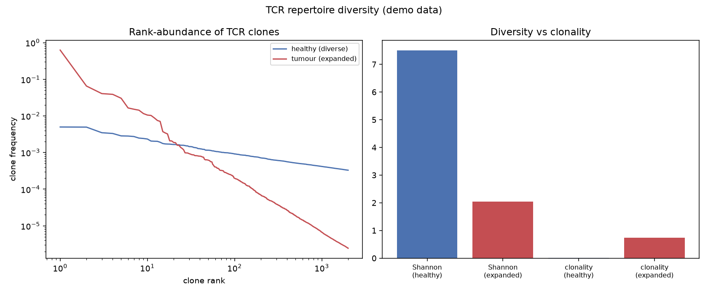

# TCR Repertoire Diversity

Your T cells carry millions of distinct receptors, one per clone. When a few clones expand to dominate — fighting a tumour or an infection — the shape of that repertoire changes, and immunologists read the change with two numbers: diversity and clonality.

## Why This Matters

A healthy T-cell repertoire is broad and even: many clones, none dominant. Under a strong antigen response — including inside a tumour — a handful of clones expand enormously, collapsing diversity and raising *clonality*. That shift is a biomarker: high intratumoural clonality can signal an active anti-tumour response and has been linked to immunotherapy outcomes. Shannon diversity captures the evenness, and clonality (its normalised complement) captures how concentrated the repertoire has become.

## How It Works

1. Represent each sample as a list of clone frequencies.
2. Compute Shannon diversity and clonality (1 - normalised Shannon).
3. Compare a diverse repertoire against a clonally expanded one.

## What the Demo Shows



The rank-abundance curves show a diverse healthy repertoire versus a tumour repertoire dominated by a few clones. The metrics panel makes it quantitative: diversity falls and clonality rises with expansion — the fingerprint of a focused immune response.

## Run It

```bash
pip install -r requirements.txt
python demo.py
```

> Demonstrated on synthetic data, so it's fully reproducible with no external downloads.
